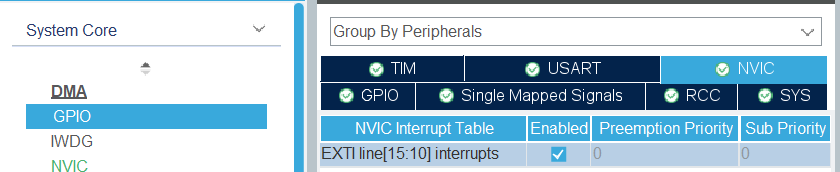

# Project for bule botton & CCW/CW motor control

## reference
1. interrupt
https://wiki.st.com/stm32mcu/wiki/Getting_started_with_EXTI  
    1. .ioc setting
    2. add in main.c
    <pre><code>/* USER CODE BEGIN 4 */
    void HAL_GPIO_EXTI_Callback(uint16_t GPIO_Pin)
    {
    if(GPIO_Pin == GPIO_PIN_13) {
        HAL_GPIO_WritePin(GPIOA, GPIO_PIN_5, GPIO_PIN_SET);
    } else {
        __NOP();
    }
    }
    /* USER CODE END 4 */</code></pre>

2. USART
<pre><code>/* USER CODE BEGIN PFP */
#define PUTCHAR_PROTOTYPE int __io_putchar(int ch)
/* USER CODE END PFP */
…
  /* USER CODE BEGIN WHILE */
  while (1)
  {
         printf("Hello World\n\r");
         HAL_Delay(1000);
    /* USER CODE END WHILE */

…
/* USER CODE BEGIN 4 */
/**
  * @brief  Retargets the C library printf function to the USART.
  * @param  None
  * @retval None
  */
PUTCHAR_PROTOTYPE
{
  /* Place your implementation of fputc here */
  /* e.g. write a character to the USART1 and Loop until the end of transmission */
  HAL_UART_Transmit(&huart2, (uint8_t *)&ch, 1, 0xFFFF);

  return ch;
}

/* USER CODE END 4 */</code></pre>